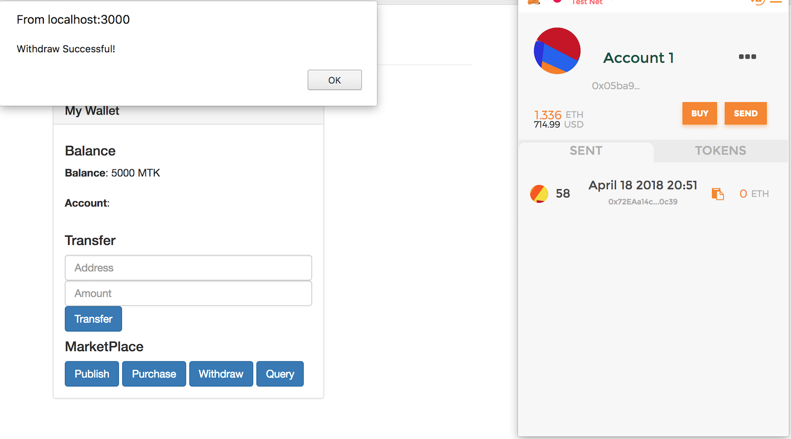

# Smart Contract Marketplace with Ropsten 

```
name: Demo a prototype data marketplace with Ropsten Test Net
type: development
status: initial draft
editor: Fang Gong <fang@oceanprotocol.com>
date: 04/18/2018
```

## Objective

In this prototype, the smart contract marketplace is deployed into Ropsten testnet. A frontend page is built to interact with the smart contract with MetaMask.

We skip the same procedures as previous demo with TestRPC and focus on the procedures for Ropsten only.


## Procedures

### 1. Network Settings
 
First the `truffle.js` file needs the ropsten network settings. The infura settings is used to access the Ropsten network. 


### 2. Deploy the Contracts to Ropsten

The smart contracts can be deployed to Ropsten network using command:

```
$ truffle migrate --network ropsten
```
The console output shall look like similar to:


Here both contracts are deployed to Ropsten:

* Token contract address: `0xa8bcfa5c0d2cc61fd49e6e06c9738c310ffac77b`

* Marketplace contract address: `0x72eaa14c6b0d181169c13a92554626c3fe6f0c39`


### 3. Built Frontend to Interact with Contracts

The contracts is deployed on Ropsten which shall be interacted using MetaMask. To do so, we need frontend to trigger the transactions. 

The frontend files locate at `src/` directory and there are two important files:

* `index.html`: it defines the framework of the webpage including buttons and input fields.

* `js/app.js`: it binds the button actions with the contract functions. It invokes the transaction sent to smart contracts on Ropsten. Please see [app.js](src/js/app.js) for details.

The `lite-server` is used to provide the service. Launch the server as:

```
$ npm run dev
```

The frontend page shall pop out at `http://localhost:3000` and look like this:


It has several buttons:

* **Transfer**: user can fill in the address and amount of tokens. Clicking `Transfer` button will transfer those tokens from his wallet to recepient.

*  **Publish**: click this button and a `publish` transaction will be sent to contracts on Ropsten network. It add a new data asset into the asset registry. For demo purpose, the information of data asset is predefined and hard-coded in the App.js file.

* **Purchase**: This button will trigger a transaction to purchase the data asset. The payment of tokens will be transferred to the Marketplace contract. 
 
* **Withdraw**: Owner of data asset can click `Withdraw` button to withdraw the balance of his asset into his own wallet. The smart contract guarantees only the owner of the data asset will receive the tokens. 

* **Query**: It queries the owner of data asset and balance of contract. This button is mainly for debugging purpose.

A sample transaction looks like below:



### 4. Interact with Contracts

To verify the frontend can interact with smart contract, I did following testing:

* User first publish data asset so that the asset info is added into contracts;
* Another User purchases the data asset and his tokens were transferred to contracts;
* Owner withdraws the balance of asset and tokens were transferred to his wallet;
* All these transactions can be verified through etherscan record.

Remember to use two separate browsers (e.g., Chrome and Firefox). Each one has one user account in MetaMask (e.g., import with secret words). Both browsers opens the frontend page `localhost:3000` to simulate two users' activities. 

* Here are 3 transactions of **first user** in Ropsten etherscan which includes:
	
	* transfer ERC20 tokens to the other user;
	* publish a new data asset;
	* withdraw the balance of data asset into his own wallet. 


* The **second user** account has two transactions in Etherscan to purchase the published data asset:

	* `approve` transaction to allow contract to transfer tokens from his wallet;
	* `transferFrom` transaction to transfer ERC20 tokens to the contract for payment.


Note that these transactions are interacting with `Token` and `Marketplace` contracts on Ropsten. The contract addresses of these two contracts are shown in the `to` columns in the transaction list.


### 5. Debugging Tricks

#### 5.1 Sync all Browsers

If the frontend at `localhost:3000` cannot connected with MetaMask, try to open the configuration page at `localhost:3001`. Click `sync all` and it shall connect the MetaMask with this page.


### 5.2 Pending transactions 

Sometime the transactions were pending there for a while. Try to switch to `Main Ethereum Network` and switch it back to `Ropsten Test Net`. The transaction may be cleared. 

### 5.3 Deploy Network Issue

If `truffle migrate` encounters an error, try to set the `gas` and `gas price` in the `truffle.js` file with proper values. Usually it can resolve the problem.

 
