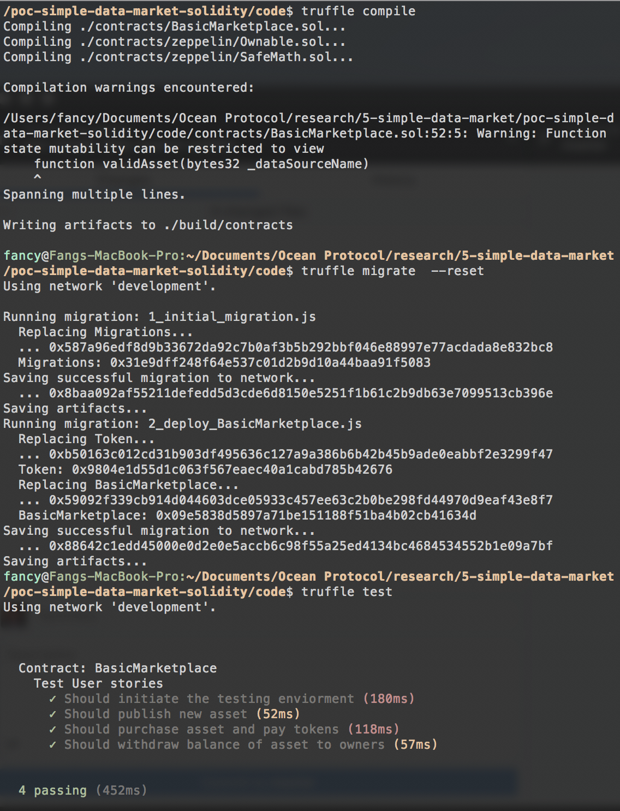

# Smart Contract Marketplace with TestRPC 

```
name: Demo a prototype data marketplace with testRPC
type: development
status: initial draft
editor: Fang Gong <fang@oceanprotocol.com>
date: 04/16/2018 (updated: 04/17/2018)
```

## Procedures:

### 1. Solidity Contract

First, we use Truffle and OpenZeppelin frameworks to build the project structure. The overview of folders and files is shown as below:


#### 1.1 Truffle framework

In the root of directory, initiate a Solidity project as:

```
$ mkdir maketplace
$ cd marketplace
$ truffle init
```

#### 1.2 OpenZeppelin framework

This project needs `StandardToken`, `SafeMath` and `Ownable` from OpenZeppelin. For simplicity, I downloaded related files and put them under `zeppelin` folder. As such, we can include them in Solidity contract as:

```
import './zeppelin/Ownable.sol';
import './zeppelin/SafeMath.sol';
...
```

#### 1.3 Contract Source Files

There are two contracts in this project:

* **Token**: [solidity file](contracts/Token.sol) It implements a intrinstic tokens used in this data Marketplace which inherits from StandardToken in OpenZeppelin.

This file defines the parameters of tokens and its behavior:

```
string public constant name = 'TestToken'; // Set the token name for display
string public constant symbol = 'TEST';  // Set the token symbol for display
uint8 public constant decimals = 8;   // Set the number of decimals for display
uint256 public constant INITIAL_SUPPLY = 150000000 * 10**8; 

function transfer(address _to, uint256 _value) 
...
function transferFrom(address _from, address _to, uint256 _value)  
...
function approve(address _spender, uint256 _value)
...
function allowance(address _owner, address _spender) 
```

* **MarketPlace**: [solidity file](contracts/BasicMarketplace.sol) It includes the contract implementation of marketplace, such as `publish`, `purchase` and `withdraw` functions. 

The key functions are following:


### 2. Migration Settings

Under the `migration` folder, create a migration file `2_deploy_BasicMarketplace.js` as:


### 3. Network Settings

At this time, we first deploy the smart contracts to testRPC in local. Therefore, we modify the `truffle.js` file as:


### 4. Testing Files

To test the functionality of contracts, we composite testing javascript file `TestSystem.js` under the `test` folder.

In this testing file, we first deploy the `Token` contract and **allocate initial tokens to four accounts** in testRPC, which will be valid through the entire testing process.


Then, we use three functions to test `publish`, `purchase` and `withdraw` functions.


Below is the output of the workflow which shows all testings are passed:





## 5. Keynote about Smart Contracts：

### 5.1 Web3 in JS cannot access return value of contract transaction

Even though the function in smart contract returns value (e.g., boolean or uint), it cannot be accessed in Javascript using web3 and shall not be checked in testing. This method is `transaction` which modifies the state of contract, so the return of a transaction to JS is a tx hash. To check the result, remember to use `call` method to query the return value from the contract function. 


For example, this function returns the address of the contract. 

```
function getAddress() public returns (address) {
        return address(this);
    }
```
If we uses JS and `transaction method` to check its return value:

```
const result = await marketPlace.getAddress();
console.log(result);
```

The return looks like:


To query its return value, use the `call()` method for instead:

```
const result = await marketPlace.getAddress.call();
console.log(result);
```

The output is `0xbf8f04422211f5ed1e208e0ecfb26ada7b9574dc`

If the smart contract function is not suitable to be called using `call()` method (e.g., it does token transfer or etc.), it is better to use another function to return the balance of account and use `call()` method to check the account balance.

Note that the `status` keyword in tx hash record means:

* 0 - tx fails
* 1 - tx success

### 5.2 ERC20 token transfer issue

The standard ERC20 token has several interfaces as:

```
contract IERC20 {
  function balanceOf(address who) public constant returns (uint256);
  function transfer(address to, uint256 value) public returns (bool);
  function allowance(address owner, address spender) public constant returns (uint256);
  function transferFrom(address from, address to, uint256 value) public returns (bool);
  function approve(address spender, uint256 value) public returns (bool);
  event Transfer(address indexed from, address indexed to, uint256 value);
  event Approval(address indexed owner, address indexed spender, uint256 value);
}
```

* **transfer fund from user to contract (deposit):**

There are two actors in this scenario: `user` and `contract`. In order to enable the `contract` withdraw the fund from `user`'s account, the `user` must first *approve* certain amount which can be spent by the `contract`.

**Key point**: the `user` must first call `approve` **outside** the contract, because *contract can't just give itself permission to take somebody's tokens*.

Related functions:

```
  //query the amount of fund that the spender can move from user's account (does not change state)
  function allowance(address owner, address spender) public constant returns (uint256);
  
  //indeed move the fund from user to contract - the `contract` call this function
  function transferFrom(address from, address to, uint256 value) public returns (bool);
  
  //`user` approve the contract to spend certain amount of tokens in his account - called outside contract
  function approve(address spender, uint256 value) public returns (bool);
```

Example use case:

First, the user need to call `approve` in JS (outside of contract):

```javascript
// user accounts[2] first approves the contract to spend his 100 tokens
await token.approve(marketPlace.address, 100, { from: accounts[2]} );

// user call the contract function to deposit money into contract
await marketPlace.purchase(data, { from: accounts[2]});
```

In the smart contract `.sol` file:

```solidity
// 3. User purchase the dataSourceName of provider - make payment
    function purchase(bytes32 _dataSourceName) public returns (bool success){
        mToken.transferFrom(msg.sender, address(this), 100);
        return true;
    }
```

As such, the user can successfully deposit 100 tokens into the contract.


* **transfer fund from contract to user:**

The second scenario is the `user` withdraw the fund from `contrac` to his own wallet. This is much simpler, because the `contract` can directly move the fund into `user`'s wallet inside the contract.

Simply use `transfer` function as below in the solidity function:

```solidity
function withdraw(bytes32 _dataSourceName) public returns (bool success){
      mToken.transfer(msg.sender, 100);
      return true;
    }
```

Remember to distinguish these two different situations and use the proper method to transfer. :)

### 5.3 Approach to allocate tokens to accounts in testing:

In testing with ERC20 tokens, it is must to allocate initial tokens into accounts, so they can interact with each other and the smart contracts. To do so, there are two choices:

* Javascript testing file: use the following function at the beginning of test file.

``` javascript
// initialize accounts balances - accounts[0] is owner of Token contract
  it('Should initiate the testing enviorment', async () => {
    let token = await Token.deployed();
    // transfer tokens
    await token.transfer(accounts[1],100000,{from:accounts[0]});
    await token.transfer(accounts[2],100000,{from:accounts[0]});
    await token.transfer(accounts[3],100000,{from:accounts[0]});
    // validate balance
    let bal1 = await token.balanceOf.call(accounts[1]);
    let bal2 = await token.balanceOf.call(accounts[2]);
    let bal3 = await token.balanceOf.call(accounts[3]);;
    assert.equal(100000,bal1.toNumber(), "balances not equal");
    assert.equal(100000,bal2.toNumber(), "balances not equal");
    assert.equal(100000,bal3.toNumber(), "balances not equal");
  });
```

* JS migration file: use the following in the token deploy JS.

```javascript
module.exports = function(deployer) {


  var id = 0;

  async function giveTokensTo() {
    if (id === 3) { return; } // allocate tokens to first three accounts
    const token = await Token.deployed();
    // obtain address in TestRPC
    const actor = web3.eth.accounts[id];
    id = id + 1;
    await token.transfer(actor, 100000);
    giveTokensTo();
  }

  // start to allocate tokens to first four accounts
  deployer.deploy(Token).then(()=>{
    giveTokensTo();
  });
};
```
